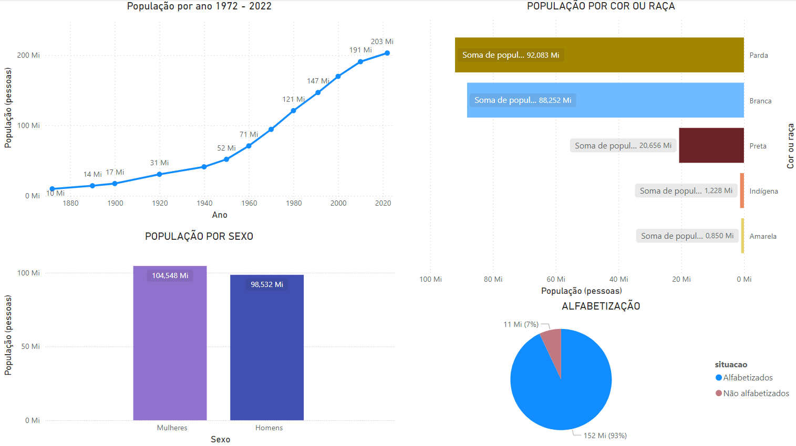
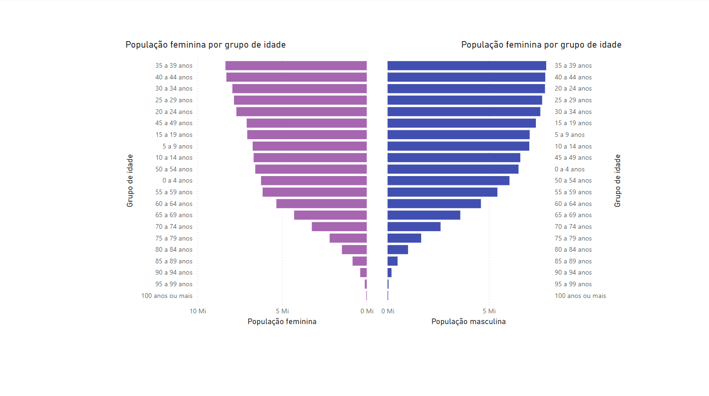
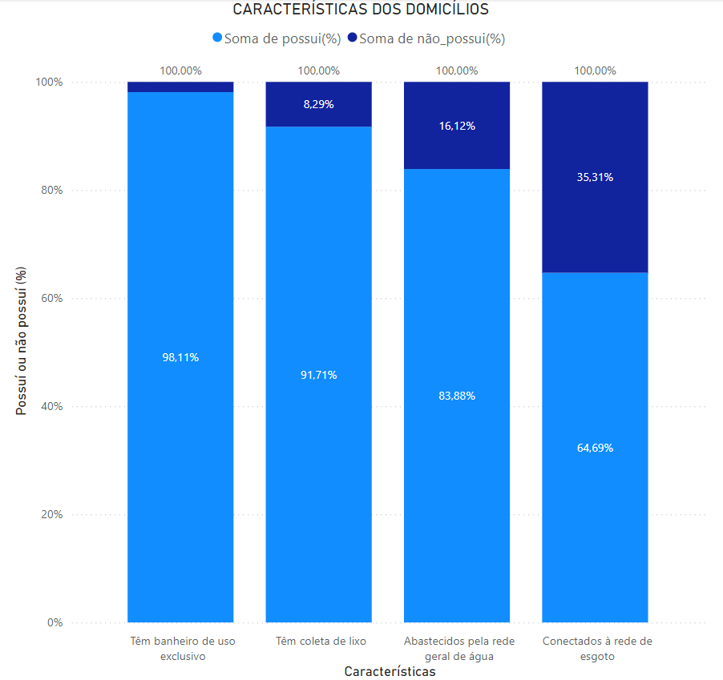
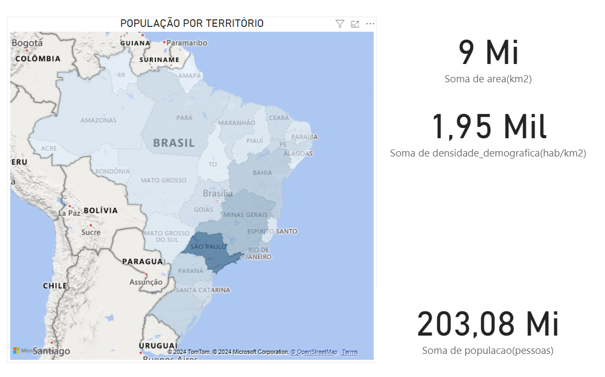

# PROJETO CENSO BRASILEIRO 2022 - IBGE

O objetivo deste projeto foi escolher um setor onde eu pudesse colocar em prática o uso de algumas ferramentas e técnicas de análise de dados.

A escolha do tema para análise foi: Censo 2022 da População Brasileira.

Os dados foram extraídos de forma supervisionada e automática. Para que a análise do projeto não se tornasse tão extensa, focou-se na população brasileira como um todo, sem análise subjetiva dos territórios. Os dados foram extraídos do IBGE.

Neste projeto, foram seguidos alguns passos para guiar o desenvolvimento:

- Perguntas

- Preparação

- Processo

- Análise

- Compartilhamento

As perguntas feitas e respondidas neste projeto foram:

- **Qual a população do Brasil em 2022?** 203.080.756 milhões.

- **Qual o crescimento populacional em relação aos anos anteriores?** Em média, 29,67%.

- **Qual o sexo que lidera os números atualmente?** Mulheres com 104.548.352 milhões (51,48%), enquanto os homens estão atrás com 98.532.432 milhões (48,52%).

- **Qual o território menos populoso?** Roraima, com 1.798.794 milhões.

- **Qual o território mais populoso?** São Paulo, com 235.975.270 milhões.

- **Qual o território menos denso?** Amazonas, com 2,53 hab/km².

- **Qual o território mais denso?** Distrito Federal, com 489,06 hab/km².

- **Alfabetização** 93 % (152 Mi) são alfabetizados e 7% (11 Mi) não são alfabetizados

Acessos a recursos básicos:

- **Banheiro de uso exclusivo:** 98,11% possuem, 1,89% não possuem.

- **Coleta de lixo:** 91,71% possuem, 8,29% não possuem.

- **Abastecimento pela rede geral de água:** 83,88% possuem, 16,12% não possuem.

- **Conexão à rede de esgoto:** 64,69% possuem, 35,31% não possuem.

Com o censo, conseguimos observar a evolução da população no Brasil e tomar medidas preventivas e até mesmo erradicar certos problemas. A pergunta que mais me deixou curioso foi: por que os números mostram que 35,31% da população brasileira não possui conexão à rede de esgoto? Quais são os problemas enfrentados para que essa parcela da população não tenha essa conexão direta?

## VISUALIZAÇÕES POWER BI

